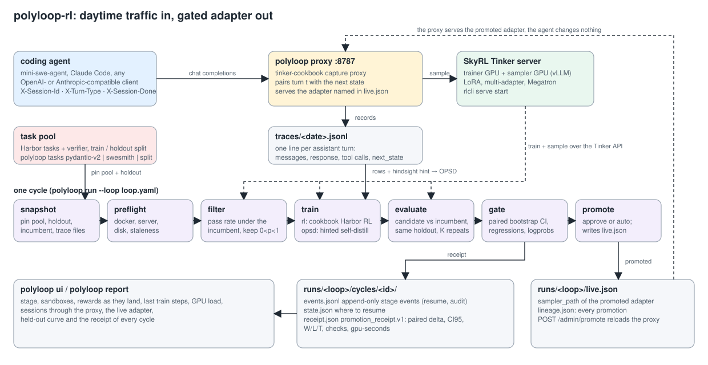

# polyloop-rl

A harness that keeps a deployed agent policy learning from its own traffic. It runs **cycles**:
capture the day's agent sessions through a proxy, take the current adapter, find the tasks it
half-solves, train on them (RL on verifiable tasks, then hinted on-policy self-distillation on the
captured traces), score the result against the incumbent on a fixed held-out split, write a
receipt, and promote only if the receipt says so. The proxy then serves the promoted adapter, so
the agent never changes.

The controller is code. An agent (Claude, Codex, a script) can propose tasks, config changes and
diagnoses through a recipe, but it cannot touch what is measured: the held-out split, the
thresholds, the budget and the lineage are declared in `loop.yaml` and owned by the controller.



Status: **v0 (September 2026).** The first complete unattended cycle ran on 2026-09-16 on a real
coding-agent workload and the gate rejected the candidate; the numbers and why are in
[`docs/RESULTS.md`](docs/RESULTS.md). On 2026-09-18 the same loop ran a second kind of agent through the environment interface: a voice
receptionist scored by Coval's simulated callers, in the [polyvoice](https://github.com/polygramme/polyvoice)
package. Two cycles: Qwen3.5-4B was rejected by a hair (+0.049 on 8 held-out scenarios), and PhoneLLM Alpha 1
(Daily's phone-agent SFT of Nemotron 3 Nano 30B) earned the loop's first promotion, 0.875 → 0.953, delta
+0.078 with a 95% CI of [+0.031, +0.125], 5 wins / 0 losses / 3 ties; receipts in that repo.
Nothing here is a product yet. Everything runs on one GPU node you own;
there is no hosted service in this repo.

## What a cycle does

```
snapshot   pin the task pool, the held-out split (by id), the incumbent adapter and the trace files
preflight  config-only checks: pool, holdout, docker, trainer server, disk, staleness bound
filter     measure pass rate under the incumbent; keep tasks with 0 < pass < 1 (zero advantage otherwise)
           (filter and evaluate ask the loop's *environment* for episodes: Docker sandboxes, a simulated
            caller, anything that implements four methods; see docs/ENVIRONMENTS.md)
train      stage 1 rl:   cookbook Harbor RL, LoRA, token-in/token-out, resumed from the incumbent
           stage 2 opsd: hinted on-policy self-distillation on the captured traces, chained on stage 1
evaluate   candidate and incumbent on the same held-out tasks, K repeats, paired per task
gate       paired delta > min_delta, regressions <= cap, trainer-vs-sampler logprob agreement  -> receipt.json
promote    approve (default: a human runs `polyloop approve <cycle>`) or auto; writes live.json, tells the proxy
observe    hook for rollback rules once an endpoint serves the adapter (not in the single-node demo)
```

Every cycle is a directory of append-only events plus the artifacts each stage wrote, so a cycle
can be resumed, audited, or replayed. The lineage of promoted adapters is one JSON file.

### Where the traces come from

`polyloop proxy` is an OpenAI- and Anthropic-compatible endpoint (tinker-cookbook's capture proxy
underneath) that samples from the Tinker server with whatever adapter `live.json` names. It groups
requests by `X-Session-Id`, keeps only `X-Turn-Type: main` turns, and pairs assistant turn *t* with
the **next state** (the tool result or user reply that arrived in turn *t+1*). Each turn is one line
in `traces/<date>.jsonl`. The train stage turns those lines into OPSD rows: the prompt prefix plus a
hindsight hint built from the next state, which the teacher sees and the student does not. This is
the OpenClaw-RL contract, with the proxy holding the same tokenizer as the trainer.

## The demo: pydantic v1 → v2 migration, nightly

- Task: pydantic 2.11.7 test modules hoisted into a single `app.py`, then downgraded to v1 idioms
  (`.dict()`, `.parse_obj()`, `@validator`, `class Config`, `Field(regex=)`, ...). The agent has to
  migrate `app.py` so a hidden `test_app.py` passes under
  `-W error::pydantic.warnings.PydanticDeprecatedSince20`. Built by `polyloop tasks pydantic-v2`,
  triple-filtered (v1 fails, v2 reference passes, strict mode enforced). 67 tasks, split by source
  test file into 41 train / 24 held-out.
- Agent: [mini-swe-agent](https://github.com/SWE-agent/mini-swe-agent) in text mode, driven through
  the proxy by `polyloop sessions` (Docker on the node, or a local working copy on a laptop).
- Model: `Qwen/Qwen3.5-4B` with a LoRA adapter (rank 32), trained with SkyRL through the Tinker API.
  The 9B variant (`recipes/pydantic-v2/loop.yaml`) already solves 95% of the pool, so the 4B recipe is
  the one with headroom.
- Hardware: one Lambda node (4×A6000 48 GB, or 2×H100). One GPU trains, one samples, the CPUs run sandboxes.

Cycle 1 result (2026-09-16): base 0.844 → candidate 0.875 on the 24 held-out tasks × 4 repeats,
paired delta +0.031 with a 95% CI of [−0.042, +0.104], 6 wins / 4 losses / 14 ties. The gate
rejected it, correctly: the pool is too easy for a +10-point criterion. Details, per-step metrics and
the receipt are in `docs/RESULTS.md` and `docs/results/`.

A second recipe, `recipes/swe-mini/`, targets SWE-smith tasks with a SWE-bench Verified holdout
(`polyloop tasks swesmith`); it has not run a full cycle yet.

## Install (on the GPU node)

`scripts/node_up.sh` does all of this idempotently on a fresh Ubuntu 22.04 / CUDA 12.8 node:
clones SkyRL, tinker-cookbook, rlcli and this repo at known refs, builds the venvs, writes
`~/serve.sh` with the memory settings that fit a 48 GB sampler, and builds the task base image.

```bash
git clone https://github.com/runnerelectrode/polyloop-rl && cd polyloop-rl
uv venv ~/venvs/polyloop --python 3.12
uv pip install --python ~/venvs/polyloop/bin/python -e ".[run]" \
  "tinker-cookbook @ git+https://github.com/thinking-machines-lab/tinker-cookbook@f46eddde86e5397138917516a6c69d2ecbf538b1"

# trainer + sampler: SkyRL's Tinker-compatible server (see scripts/node_up.sh for the full flags)
rlcli serve start --base-model Qwen/Qwen3.5-4B --backend megatron --gpus 1 --tp 1 --max-model-len 32768 \
  --backend-config '{"trainer.placement.colocate_all": false, "trainer.policy.language_model_only": true}'

# task pool and held-out split
polyloop tasks pydantic-v2 --pydantic-repo ~/src/pydantic --python ~/venvs/pyd/bin/python --out ~/polyloop-tasks/pool
polyloop tasks split --pool ~/polyloop-tasks/pool --out ~/polyloop-tasks/pydantic-v2 --by source_test
```

## Run

```bash
L=recipes/pydantic-v2/loop-4b.yaml
polyloop warm     --loop $L                                  # bring the sampler engines up once
polyloop proxy    --loop $L --port 8787                      # the endpoint the agent talks to (captures traces)
polyloop sessions --tasks ~/polyloop-tasks/pydantic-v2/train --n 24 --proxy http://127.0.0.1:8787 --env docker
polyloop eval     --loop $L --limit 24                       # baseline of the incumbent on the holdout
polyloop run      --loop $L                                  # one full cycle: snapshot ... gate
polyloop history  --loop $L                                  # cycles, deltas, lineage
polyloop approve  --loop $L <cycle-id>                       # promote a gated candidate; the proxy reloads it
polyloop run      --loop $L --cycle <cycle-id>               # resume a cycle at its next stage
polyloop report   --loop $L --out report.html                # static page: curve, cycles, receipts
polyloop ui       --loop $L --port 8080 --log ~/logs/cycle.log   # live page on the node (stdlib server)
```

To watch from a laptop, forward the node's ports and point the agent at the proxy:

```bash
ssh -N -L 8080:127.0.0.1:8080 -L 8787:127.0.0.1:8787 ubuntu@<node>
polyloop sessions --tasks <train-split> --n 6 --proxy http://127.0.0.1:8787 --env local --python <venv-with-pydantic>
```

The UI shows the current cycle's stage, sandboxes running, episodes as their rewards land, the last
training steps, GPU load, sessions that went through the proxy, the adapter the proxy is serving, and
the held-out curve and receipts from every cycle so far.

`loop.yaml` declares the model, the proxy, the environment (where episodes come from, see
`docs/ENVIRONMENTS.md`), the stages (`rl`, `opsd`, each with its own budget and hyperparameters),
the sandbox limits, the filter, the budget, the gate and the promote mode.
`program.md` next to it says what a proposing agent may change.

## What it builds on

| Piece | Where it comes from |
|---|---|
| Trainer + sampler with a Tinker API, LoRA, multi-adapter | [SkyRL](https://github.com/NovaSky-AI/SkyRL) via [rlcli](https://github.com/polygramme/rlcli) |
| Harbor bash-tool RL loop, async off-policy bound, capture proxy, OPSD loop | [tinker-cookbook](https://github.com/thinking-machines-lab/tinker-cookbook) `recipes/harbor_rl`, `capture/proxy`, `distillation` |
| Token-in/token-out bridge, Docker sandbox, logprob agreement guard, hinted teacher | rlcli (`tito_bridge`, `sandbox_docker`, `logprob_guard`, `opsd`) |
| Session headers, next-state hint, "harness must ingest, learn, grade" | [OpenClaw-RL](https://github.com/Gen-Verse/OpenClaw-RL) (contract only; this proxy is token-exact) |
| Task format and the SWE-bench Verified tasks | [Harbor](https://github.com/harbor-framework/harbor) |
| The coding agent driven through the proxy | [mini-swe-agent](https://github.com/SWE-agent/mini-swe-agent) |
| Verifier recipe and reward-hack closures for SWE-smith | [Agent Lightning](https://github.com/microsoft/agent-lightning) `examples/swe_smith` |
| RL on API migration (function level) | ReCode, AAAI 2026: the prior result this task family extends to repo-level, gated, nightly |
| Pass-rate filter (0 < pass < 1) | [Lego-RL](https://github.com/LegoX/Lego-RL) preflight |
| Attempt contract, event log, "agent proposes, code measures" | [OpenRL autoresearch](https://github.com/gke-labs/open-rl) |
| Budget overrun = no candidate, never a partial one | Baseten's [rlm](https://github.com/basetenlabs/rlm) fork |
| Receipt shape | Understudy `promotion_receipt.v1` |

`docs/DESIGN.md` has the design, `docs/PRECEDENTS.md` what was surveyed, `docs/DEMO-PLAN.md` the
plan this demo followed, `docs/BORROW-MAP.md` exactly which upstream functions are reused.

## Layout

```
polyloop/
  config.py        loop.yaml -> LoopConfig (stages: rl | opsd, proxy, traces, filter, gate, promote)
  events.py        per-cycle events.jsonl + state.json, lineage.json
  stages.py        the eight stages, multi-stage train, resume logic, proxy notification
  receipt.py       paired stats, bootstrap CI, promotion_receipt.v1
  environment.py   the Environment protocol + registry (tasks, rollouts, preflight, session hints)
  envs/            harbor_docker: the default environment (Harbor tasks, cookbook bash loop, Docker)
  proxy.py         capture proxy: session headers, next-state pairing, live adapter, /admin routes
  sessions.py      drive mini-swe-agent through the proxy (local or docker), verify, log
  ui.py, report.py live page and static report
  harness/
    rollout.py     K episodes per task for one checkpoint (filter + evaluate), engine warm-up
    train.py       rl worker: cookbook Harbor RL run from a JSON spec, in its own process
    train_opsd.py  opsd worker: hinted on-policy self-distillation from trace rows
    trace_rows.py  traces/*.jsonl -> {messages, hint} rows
    kl_guard.py    tolerant KL-to-sampler metric (logs length mismatches instead of crashing)
  tasks/
    pydantic_v2.py pydantic tests -> v1-idiom migration tasks with a strict verifier
    swesmith.py    SWE-smith rows -> Harbor tasks with a fast verifier
  cli.py           run | approve | history | status | eval | warm | proxy | sessions | ui | report | tasks
recipes/pydantic-v2/   loop.yaml (9B), loop-4b.yaml (4B), agent.yaml (mini-swe-agent)
recipes/swe-mini/      loop.yaml + program.md
scripts/               node_up.sh (node bring-up), arch_diagram.py (docs/architecture.svg)
docs/                  DESIGN, ENVIRONMENTS, PRECEDENTS, DEMO-PLAN, BORROW-MAP, RESULTS, VOICE-LOOP-PLAN, results/
tests/                 runner tests on a scripted environment (no GPU, no Docker)
```

## License

Apache-2.0.
